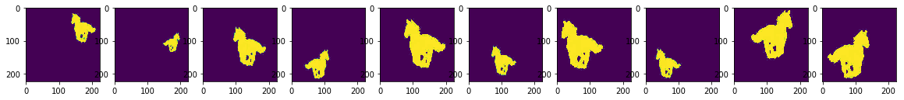

Problem Statement: Develop a neural network that can generate sophiticated depth maps and masks on the input images. There are a few non AI mechanism available in the real world. However, depth sensing from a 2D image is not yet only be possible without AI. It is very frustrating to rely on imperative way of programs that fails when an object is at the corner of the image, in a perfect lightning condition. One can simply genreate a depth map and a mask but the environment conditions has to be strict. Whereas using AI one can continue to excel to solve these problems.

Research papers on Monocular depth estimation(https://arxiv.org/pdf/1812.11941.pdf) and Mask R-CNN(https://arxiv.org/pdf/1703.06870.pdf) has certainly increased the enthuuthiasm. 

This assignment program focusses on data creation from scratch which is a crucial task for an AI/ML engineer to do. Unavailability of data arises a need to generate data close to reality. The following steps were taken to generate the dataset - 
********** Remeber 0.4M is the target set for each type of image data*********
1. Google ImageSearch - one can use GoogleImageSearch python packages to serach for a image on a topic or list of topics. Through the collection of 100 Foreground(FG) and 100 Background(BG) Images have happened.
2. Overlaying 100 FG images (with 100 flipped version of GF) at 20 random X,Y co-ordinates on single BG results in 4000.
3. Repeating above step for 100 BG images results 100x4000 = 400000 images in dataset
3. Generating Masking of FG_BG overlat=y images - use and opnen source e.g.- CV2 lib
4. Generate Depth Maps of FG_BG images by using the depth maps model from https://github.com/ialhashim/DenseDepth/blob/master/DenseDepth.ipynb

# Google Drive Path of Dataset 
https://drive.google.com/open?id=1DdJVEIpkjowuRwH1vAcnWSK1aG0bYh9h
The dataset has this hierarchy - 
bg1>
  fg_1>
  fg_2>
  .
  .
  fg_100>
    mask>
      1.jpg
      .
      .
      40.jpg
    depth>
      1.jpg
      .
      .
      40.jpg
    overlay>
      1.jpg
      .
      .
      40.jpg

The samples of resultant are-

# 1. Display Overlay Images Sample
 

# 2. Display Mask Images Sample
 

# 3. Display Depth Images Sample
 

