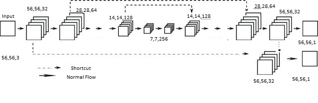
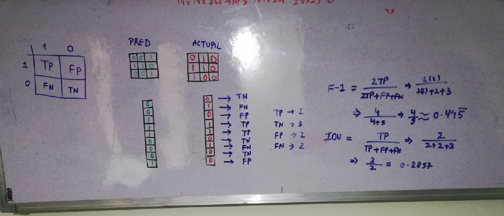

##**Bigger Problem:**
The problem this DNN Model intents to solve is occulsion of Foreground objects to Background scene. As the whole world now uses CCTV cameras and depends on CCTV operators to report any unusual activity captured on CCTV. This tradiational approach is good but involves a lot of manpower and found erroneous too based on the operator's activity. CNN with deep learning can help to eradicate tradiational approach and bring intelligence into CCTV systems. 

The dataset created to train DNN model has Foreground ovelayed on a Backgroud at random places which creates a live scene of people moving around at public places under the CCTV survillience. The DNN model aims to do what a CCTV if integrated with AI on the real video can possibly do. The problem is not just the movinf Foreground Objects but objects that are still for a quite while becomes the part of Background. E.g.- A car parked for days altogether must be added to the Background scene.

##**Dataset Creation:** The dataset is available at the links specified in this github.
	https://github.com/varinder-singh/EVA4/tree/master/S15-A

##**Model Creation:**
	The whole model architecture is based on the recent work done for generating depth maps when given a RGB image to the CNN Model. https://arxiv.org/pdf/1812.11941.pdf which defines - High Quality Monocular Depth Estimation via Transfer Learning. Followed the research for creating a encoder decoder model and deriving loss functions (must see loss section below). The architecture is simple and based on residual connections which supports not missing crucial information. The Receptive Field in such a problem should be atleat the size of the image or must be better if exceeding the image size as we always want to capture a complete Background and even some of the objects in the image lying at the corners.

At the end the model produces two output images - 1. Depth Map 2. Instance segmentation (segmenting Foreground with Background)

 

##**Loss Calculations:**
	Depth Maps:
	Picked up loss definitions from - https://arxiv.org/pdf/1812.11941.pdf. The paper states three different losses combined as one loss only for depth map as the output which are as follows -

	L(y, yˆ) = λLdepth(y, yˆ) + Lgrad(y, yˆ) + LSSIM(y, yˆ)
	depth = h is the point-wise L1 loss defined on the depth values
	Lgrad = loss defined over the image gradient g of the depth image (Custom Loss)
	LSSIM = Loss defined for Structural Similarity
	LSSIM(y, yˆ) =  (1 − SSIM(y, yˆ))/2

	λ = 0.1, kept as constant

	Lgrad is the custom gradient loss written, which differentiates each pixel with its next pixel in the X and Y axis. (See loss_gradient.py for more clarity)

##**SSIM** - Structural Similarity of the prediction and Ground Truth. Implemented using pytorch_mssim. This can help state the accuracy of the network as the values lies between -1 to 1 close to 1 means more aacurate.

##**Instance Segmentation**:	For instance segment used pytorch's BCELoss() and custom L1-LAD loss. The loss files are available in loss folder.

##**Train**:
	The dataset has 400k images in total with a ration of 70:30 is divided for train and test respetively.
	<Add more lines here wrt to train and test>

##**Accuracy**:
	It is very difficult to come out an accuracy for such a DNN as the DNN outputs images. Next thought would be on how good the output images are - which means we need a Ground Truth. Luckily our DNN is a supervised learning and we have GT available as labels created during dataset creation. Further step is how once can measure accuracy in terms of images as output and GT available.

	Since loss calculations for Depth Map and Mask is different, it is intended to keep accuracy calculation also different. The accuracy for Depth Mask is calculated based on the SSIM value of the Prediction and Ground Truth which always lies between -1 to 1.
	The accuracy for Mask is calcullated based on the F-1/Dice-Coefficient score. The scoring internally depends on confusion matrix with TP (True Positive), TN (True Negative), FP (False Positive) and FN (False Negative).
        

        	     ACTUAL  1                 0
	   			---------------------------------
		PRED	|   TP          |      FP       |
			1	|               |               |
			    ---------------------------------
			0	|   TN          |      FN       |
				|               |               |
			    ---------------------------------

	F-1/Dice:
			2TP / (2TP + FP + FN)

	IOU:
			TP / (TP + FP + FN)
	A raw image below explains considering an image and ground truth of 3x3 with F-1 and IOU calculations.
	
	Since the mask out is binary either 0 or 1 it is easier to evaluate on the above metric.
	Total accurracy of DNN is the mean of SSIM calculated for depth and F-1 score for mask
	 Acc = (SSIM+F-1)/2

##**Data Augmentations**:

	Albumentation transformations are used at runtime for train dataset -
	1. HueSaturationValue
	2. RandomBrightnessContrast
	The above are added to add augmentations as the CCTV camera will not always be placed in Spring Season :-)
	
	Throwing some numbers captured to see the change without and with Albumentation Transformations.
	Epoch = 1
	Without Albumentations - 
		Train: Loss=0.074, Acc=70.84  Test: Loss=0.88, Acc=33

	With Albumentations -
		Train: Loss=0.12403, Acc = 52.28 Test: Loss=0.65, Acc=34

	Epoch = 2
	Without Albumentations - 
		Train: Loss=0.088 Acc=71.93 Test: Loss=0.87 Acc=34

	With Albumentations -
		Train: Loss=0.12260 Acc = 55.90 Test: Loss=0.65 Acc=34
